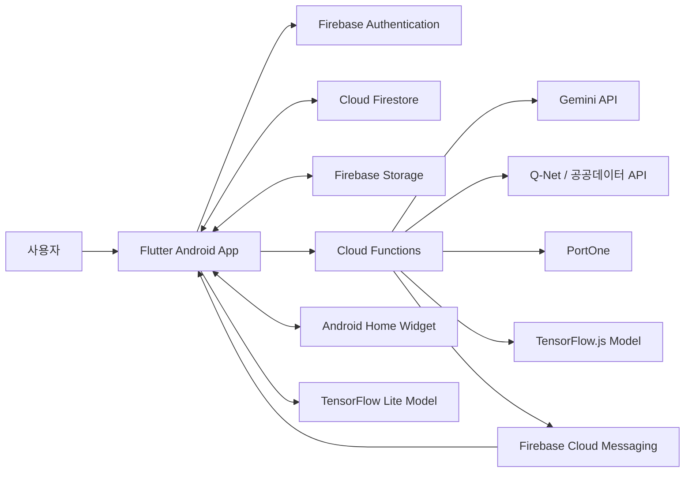

<div align="center">

  <picture>
    <source
      media="(prefers-color-scheme: dark)"
      srcset="assets/images/textLogo_dark.png"
    />
    <source
      media="(prefers-color-scheme: light)"
      srcset="assets/images/textLogo.png"
    />
    
  </picture>

<h3>자격증 탐색부터 AI 학습 관리, 스터디까지 한곳에서</h3>

  <p>
    자격증 준비에 필요한 정보와 학습 활동을 하나의 흐름으로 연결한<br />
    AI 기반 자격증 학습 플랫폼입니다.
  </p>

  <p>
    
    <a href="https://www.figma.com/design/fmxdXLPLkhEudn8sVQtDxO/%ED%94%8C%EB%9F%AC%ED%84%B0-%ED%94%84%EB%A1%9C%EC%A0%9D%ED%8A%B8-3%ED%8C%80?node-id=262-186&amp;t=thBqZZE9BvEMhFBU-1">
      
    </a>
    <a href="https://drive.google.com/file/d/1iMXjC9siGv7LFRNboSyivDUH-Sn21_1n/view?usp=sharing">
      
    </a>
  </p>

</div>

<!--
시연 영상이 준비되면 회색 Demo 배지를 실제 영상 링크가 연결된 YouTube 배지로 교체하세요.
-->

---

## 프로젝트 소개

자격증을 준비할 때는 시험 정보 검색, 일정 확인, 학습 계획 수립, 공부 기록, 스터디 활동을 서로 다른 서비스에서 관리해야 합니다.

**따IT!** 은 흩어진 준비 과정을 하나의 애플리케이션으로 연결해 사용자가 목표를 정하고 꾸준히 학습할 수 있도록 돕습니다.

자격증 정보와 시험 일정을 제공하고, AI를 활용해 개인별 학습 계획·자료 요약·문제 생성을 지원합니다.

스터디와 커뮤니티, 알림, 홈 위젯을 통해 혼자서도 함께여도 학습 흐름을 이어갈 수 있도록 설계했습니다.

| 구분 | 내용 |
| --- | --- |
| 프로젝트명 | 따iT! |
| 개발 기간 | 2026.07.13 ~ 2026.08.10 |
| 개발 형태 | 팀 프로젝트 |
| 팀 구성 | 총 4명 |
| 지원 플랫폼 | Android |
| 주요 기술 |      |

<!--
대표 시연 GIF가 준비되면 아래 주석을 해제하세요.
GIF는 10~20초, 가로 800~1000px, 10MB 이하를 권장합니다.

<div align="center">
  <a href="시연영상_URL">
    
  </a>
</div>
-->

## 주요 기능

### 1. 자격증 탐색과 일정 관리

- 국가기술·국가전문·기타 자격증을 분류별로 탐색하고 검색할 수 있습니다.
- 자격증별 시험 과목, 시험 시간, 응시 준비물, 합격 통계 등의 상세 정보를 확인할 수 있습니다.
- Q-Net 및 공공데이터 API를 연동해 시험 일정을 조회합니다.
- 목표 자격증과 시험 회차를 설정하고 홈·캘린더에서 남은 일정을 관리합니다.

### 2. AI 맞춤 학습

- 목표 자격증과 학습 조건에 맞는 단계별 학습 계획을 생성합니다.
- 일정 수행 상태에 따라 놓친 학습 계획을 다시 배분합니다.
- 업로드한 학습 자료를 요약하고 자료 또는 오답을 기반으로 문제를 생성합니다.
- 학습 진도와 퀴즈 기록을 분석해 합격 가능성과 보완이 필요한 영역을 안내합니다.
- 자격증 및 직무 탐색을 돕는 AI 챗봇과 추천 기능을 제공합니다.

### 3. 함께 공부하는 스터디

- 자격증별 공개·비공개 스터디를 생성하고 참여할 수 있습니다.
- 참여 승인, 그룹원 관리, 공지, 목표 설정 등 스터디 운영 기능을 제공합니다.
- 스톱워치와 포모도로로 과목별 공부시간을 기록합니다.
- 스터디원의 집중 상태와 공부시간을 실시간으로 공유하고 채팅할 수 있습니다.

### 4. 커뮤니티와 학습 지속 지원

- 게시글, 댓글, 좋아요, 북마크를 통해 사용자 간 정보를 공유합니다.
- 자격증 일정, 스터디, 친구, 커뮤니티 활동에 맞춘 푸시 알림을 제공합니다.
- 오늘의 할 일과 목표 시험 일정을 Android 홈 위젯에서 확인할 수 있습니다.
- Google·Kakao·Naver 소셜 로그인과 이메일 인증을 지원합니다.
- 다크 모드, 앱 아이콘 변경, 친구 및 차단 관리 기능을 제공합니다.

### 5. 운영자 관리

- 회원, 자격증, 스터디, 커뮤니티 콘텐츠를 관리할 수 있습니다.
- 신고·문의·탈퇴 요청을 확인하고 처리할 수 있습니다.
- 공지 작성, 알림 발송, 서비스 통계를 위한 관리자 화면을 제공합니다.

<!--
스크린샷을 docs/images에 넣은 뒤 아래 예시를 실제 파일명으로 교체하세요.

| 자격증 탐색 | AI 학습 | 실시간 스터디 |
| :---: | :---: | :---: |
|  |  |  |
| 자격증 정보와 시험 일정 조회 | 개인화 학습 계획과 합격 분석 | 공부시간과 목표를 함께 관리 |

| 홈 | 커뮤니티 | 마이페이지 |
| :---: | :---: | :---: |
|  |  |  |
-->

## 기술적 구현

### AI 요청과 민감 정보의 서버 분리

AI 생성, 자격증 추천, 문서 요약, 결제 검증처럼 민감한 작업은 Firebase Cloud Functions에서 처리합니다. 앱은 Callable Function으로 서버 로직을 호출하고, 사용자 데이터가 필요한 요청은 인증 상태를 검사합니다. Gemini·Q-Net·PortOne 등의 서버 키는 Firebase Secrets로 관리해 클라이언트 노출을 줄였습니다.

### 온디바이스와 서버 모델의 역할 분리

학습 계획 생성에는 앱에 포함된 TensorFlow Lite 모델을 사용하고, 학습 기록을 기반으로 한 합격 위험도 분석에는 Cloud Functions의 TensorFlow.js 모델을 사용합니다. 즉시성이 필요한 추론은 기기에서 수행하고, 여러 데이터와 후처리가 필요한 분석은 서버에서 담당하도록 나눴습니다.

### 이벤트 기반 알림 구조

친구, 커뮤니티, 스터디 채팅과 같은 활동은 Firestore 이벤트를 기준으로 알림을 생성합니다. 시험 일정과 학습 계획처럼 정해진 시점에 전달해야 하는 알림은 Scheduler 기반 함수로 처리하며, 공통 알림 로직과 도메인별 모듈을 분리했습니다.

## 시스템 아키텍처



## 기술 스택

### Frontend (Mobile Client)

<p>
  
  
  
</p>

### Backend & Database

<p>
  
  
  
  
  
</p>

### AI & Machine Learning

<p>
  
  
  
</p>

### API & Services

<p>
  
  
  
  
</p>

### Collaboration

<p>
  
  
  
  
  
</p>

## 화면 및 데이터 흐름

```text
로그인 / 회원가입
       ↓
목표 자격증 설정
       ↓
홈 ─── 자격증 정보·일정·오늘의 할 일
 ├──── 스터디 ─── 공부 기록·채팅·공동 목표
 ├──── AI ─────── 학습 계획·자료 요약·퀴즈·합격 분석
 ├──── 커뮤니티 ─ 게시글·댓글·좋아요·북마크
 └──── 마이페이지 ─ 학습 이력·친구·설정
```

## 프로젝트 구조

```text
flutterteam03/
├─ lib/
│  ├─ auth/             # 회원가입, 로그인, 계정 관리
│  ├─ home/             # 홈 대시보드와 일정 요약
│  ├─ certificate/      # 자격증 검색, 상세 정보, 시험 일정
│  ├─ ai/               # 학습 계획, 요약, 문제 생성, 합격 분석
│  ├─ study/            # 스터디, 타이머, 채팅, 공부 기록
│  ├─ community/        # 게시글과 댓글
│  ├─ notification/     # 푸시·로컬 알림 처리
│  ├─ mypage/           # 사용자 활동과 설정
│  ├─ admin/            # 서비스 운영자 기능
│  ├─ appwidgets/       # Android 홈 위젯 동기화
│  ├─ services/         # 공통 서비스
│  └─ widgets/          # 공통 UI 컴포넌트
├─ functions/           # Firebase Functions 백엔드
│  ├─ auth/
│  ├─ certification/
│  ├─ material/
│  ├─ question/
│  ├─ studyPlan/
│  ├─ notifications/
│  └─ admin/
└─ assets/              # 이미지, 아이콘, TFLite 모델
```

## 팀 구성 및 역할

따IT!은 4명의 팀원이 기능별 책임 영역을 나누고, 공통 설계와 코드 리뷰를 함께 진행한 팀 프로젝트입니다.

| 팀원 | 담당 영역 | 주요 구현 내용 |
| --- | --- | --- |
| `김예림` | `홈 메뉴` `자격증 일정` `알림` | `주요 구현 내용 추가 예정` |
| `소채연` | `로그인&회원가입` `앱 아이콘&스플래쉬` `AI 메뉴` | `주요 구현 내용 추가 예정` |
| `이다빈` | `스터디 그룹` `커뮤니티` | `주요 구현 내용 추가 예정` |
| `최제현` | `마이페이지` `관리자 기능` | `주요 구현 내용 추가 예정` |

## 팀과 협업

| 항목 | 내용 |
| --- | --- |
| 디자인 | Figma 기반 화면 설계 및 디자인 공유 |
| 형상 관리 | Git / GitHub, 기능 단위 브랜치와 Pull Request |
| 문서·일정 관리 | Notion 문서 정리, Jira 일정 관리 |

## 관련 자료

<div align="center">

  <a href="시연영상_URL">
    
  </a>
  <a href="https://www.figma.com/design/fmxdXLPLkhEudn8sVQtDxO/%ED%94%8C%EB%9F%AC%ED%84%B0-%ED%94%84%EB%A1%9C%EC%A0%9D%ED%8A%B8-3%ED%8C%80?node-id=262-186&t=thBqZZE9BvEMhFBU-1">
    
  </a>
  <a href="https://drive.google.com/file/d/1et_FkBPH1QEsAARjh_2dJzeL0mkHHQvm/view?usp=drive_link">
    
  </a>
  <a href="https://app.notion.com/p/iT-Flutter-Project-3-75e44e5f9aa283d2927f0183e2c18b96?source=copy_link">
    
  </a>

</div>

<!--
시연 영상이 준비되면 시연영상_URL을 실제 공유 링크로 교체하세요.
-->

---

<div align="center">
  <strong>자격증 준비의 시작부터 합격까지, 따IT!</strong>
</div>
